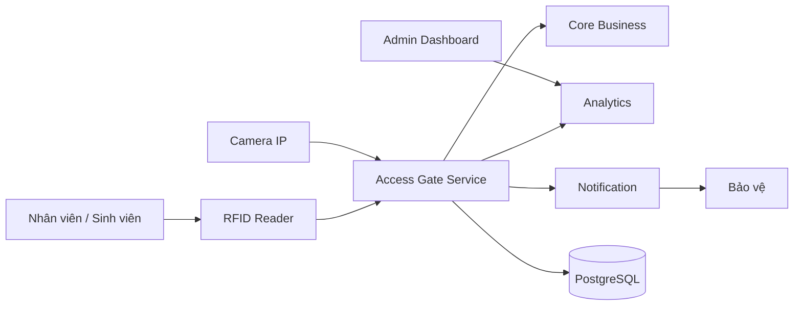

# Service Boundary của nhóm

## 1. Thông tin nhóm

- **Tên nhóm:** Nhóm 5
- **Lớp:** CNTT 17-09
- **Thành viên:** Trần Khắc Hồng, Vũ Hồng Sơn, Hà Tuấn Huy
- **Service nhóm phụ trách:** Access Gate
- **Sản phẩm tổng thể của lớp:** Smart Campus System

---

# 2. Actor

Các actor tương tác với hệ thống/service:

- Nhân viên / Sinh viên quét thẻ RFID
- Camera IP
- Bảo vệ
- Admin

---

# 3. System Boundary

## Nhóm em xây phần nào?

Nhóm xây dựng và quản lý:

- API Access Gate
- Xử lý xác thực QR/RFID
- Kiểm tra quyền ra vào
- Ghi nhận lịch sử ra vào
- Quản lý trạng thái cổng
- Kết nối database Access Gate
- Log truy cập
- Xử lý realtime mở/đóng cổng

---

## Phần nhóm kiểm soát

Nhóm trực tiếp thiết kế, lập trình và quản lý:

- Access Gate Service
- API quét RFID
- API kiểm tra quyền truy cập
- Xử lý mở/đóng cổng
- Ghi log lịch sử ra vào
- Kết nối RFID Reader
- Xử lý request từ Camera Stream
- Database của Access Gate
- Validation dữ liệu truy cập
- Gửi event/log sang hệ thống khác
- Health check và monitoring service

---

## Phần nhóm chỉ tích hợp

Nhóm không xây dựng mà chỉ kết nối sử dụng:

- AI Vision
- Analytics
- Notification
- RabbitMQ
- PostgreSQL
- Camera IP RTSP Stream
- API Gateway
- Hệ thống xác thực người dùng (Auth Service)
- Dashboard Admin
- Telegram / Email service

---

# 4. Service Boundary

## Service của nhóm có trách nhiệm gì?

Access Gate là service chịu trách nhiệm:

- Nhận dữ liệu quét RFID
- Kiểm tra quyền truy cập
- Ghi log ra vào
- Gửi dữ liệu cho Core Business
- Đồng bộ dữ liệu phân tích và cảnh báo

---

## Service KHÔNG làm gì?

Access Gate KHÔNG xử lý:

- AI nhận diện khuôn mặt
- KPI thống kê
- Gửi Telegram/Email
- Xử lý camera stream
- Business policy phức tạp

---

# 5. Input / Output

## Input

- RFID card
- REST request
- Camera trigger event
- User credential

### Ví dụ Input

```json
{
  "rfid": "RF123456",
  "gateId": "GATE_A1",
  "timestamp": "2026-05-10T10:30:00"
}
```

---

## Output

### Ví dụ Output

```json
{
  "success": true,
  "access": "granted",
  "message": "Open Gate"
}
```

---

# 6. API dự kiến

| Method | Endpoint | Mục đích |
|---|---|---|
| GET | /health | Kiểm tra service |
| POST | /access/scan | Quét RFID |
| POST | /access/check | Kiểm tra quyền |
| GET | /access/logs | Lấy lịch sử |
| POST | /gate/open | Mở cổng |
| POST | /gate/close | Đóng cổng |

---

# 7. Phụ thuộc service khác

## Service này gọi đến service nào?

Access Gate gọi đến:

- Core Business → kiểm tra policy
- Analytics → gửi log
- Notification → gửi cảnh báo

---

## Service nào gọi đến service này?

Các service/hệ thống gọi đến Access Gate:

- RFID Device
- Camera Stream
- Admin Dashboard

---

# 8. Sơ đồ minh họa



---
